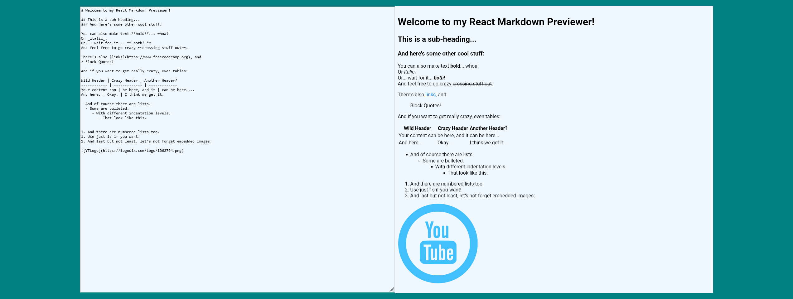

# Markdown Previewer

This is a solution to the Markdown Previewer Challenge by FreeCodeCamp. 

## Table of contents

- [Overview](#overview)
  - [Screenshot](#screenshot)
  - [Links](#links)
- [My process](#my-process)
  - [Built with](#built-with)

## Overview

### Screenshot

### Links

- Codepen URL: [Codepen URL](https://codepen.io/adhipathi/pen/NWXLjzV)
- Live Site URL: [Netlify Link](https://md-preview-fcc.netlify.app/)

## My process

### Built with

- Semantic HTML5 markup
- CSS custom properties
- Flexbox
- Mobile-first workflow
- [React](https://reactjs.org/) - JS library

